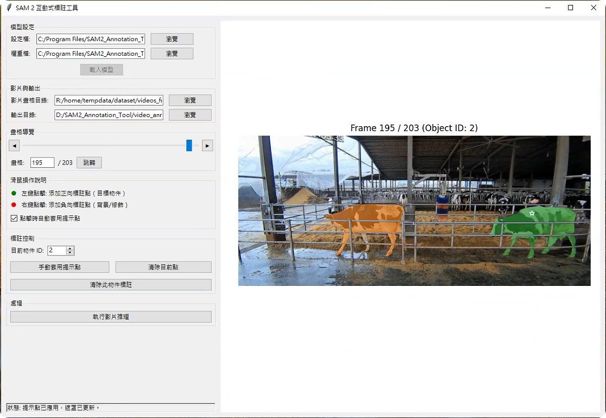

# SAM2 標註工具使用操作手冊

本手冊將指導您如何使用 SAM2 標註工具進行影片物件分割標註。

## 目錄

1. [軟體介紹](#軟體介紹)
2. [主介面概述](#主介面概述)
3. [基本操作流程](#基本操作流程)
4. [進階功能](#進階功能)
5. [輸出格式說明](#輸出格式說明)
6. [效能優化建議](#效能優化建議)
7. [故障排除](#故障排除)
8. [快速鍵參考](#快速鍵參考)

## 軟體介紹

SAM2 標註工具是基於 Meta 的 Segment Anything Model 2（SAM2）開發的互動式影片物件標註應用程式。此工具利用 SAM2 先進的分割能力，允許使用者通過簡單的點擊操作快速標註影片中的物件，並自動追蹤物件在影片序列中的變化。

### 主要特點

- **互動式標註**：通過簡單的點擊操作定義目標區域和背景
- **多物件追蹤**：支持同時追蹤多個物件
- **自動傳播**：將標註從關鍵畫格自動傳播到整個影片序列
- **視覺化預覽**：即時顯示分割結果
- **ID 遮罩輸出**：產生每個畫格的物件 ID 遮罩影像

## 主介面概述

SAM2 標註工具主介面分為以下幾個主要區域：

1. **左側控制面板**：
   - 模型設定區
   - 檔案輸入/輸出選項
   - 畫格導覽控制
   - 標註控制選項
   - 處理控制按鈕

2. **右側影像顯示區**：
   - 當前畫格顯示
   - 互動式標註區域
   - 遮罩視覺化區域

3. **底部狀態欄**：
   - 顯示處理狀態和提示訊息

## 基本操作流程

### 1. 載入模型

1. 啟動應用程式後，首先需要載入 SAM2 模型
2. 在「模型設定」區域，確認設定檔和權重檔路徑正確（預設值通常適用於大多數情況）
3. 點擊「載入模型」按鈕
4. 等待模型載入完成（視硬體效能可能需要幾秒至幾分鐘）
   
**備註:** 
設定檔路徑 `/sam2/config/sam2.1/*.yaml`
權重檔路徑 `/checkpoints/*.pt`

### 2. 選擇影片畫格目錄

1. 點擊「瀏覽」按鈕選擇包含影片畫格的目錄
   - 畫格應以序號命名，如 000001.jpg, 000002.jpg 等
2. 系統會自動掃描並載入畫格
3. 載入完成後，第一畫格將顯示在右側顯示區

### 3. 設定輸出目錄

1. 點擊「輸出目錄」旁的「瀏覽」按鈕選擇結果儲存路徑
2. 系統將在此目錄下建立 `id_masks` 子目錄存放標註結果

### 4. 標註物件

1. 使用畫格導覽控制區找到合適的起始畫格（通常是物件首次出現的畫格）
2. 確認當前物件 ID 設置正確（預設從 1 開始）
3. 在影像上使用滑鼠進行標註：
   - **左鍵點擊**：標記物件區域（正向點）
   - **右鍵點擊**：標記背景區域（負向點）
4. 每次點擊後，系統會自動計算並顯示物件遮罩
5. 若需要微調遮罩，可以繼續添加更多正向/負向點
6. 若要標註多個物件，調整「物件 ID」數值後重複以上步驟

### 5. 執行影片推理

1. 完成所有物件的標註後，點擊「執行影片推理」按鈕
2. 系統會顯示進度對話框，顯示推理進度
3. 推理過程會同時進行正向（從標註畫格到結尾）和反向（從標註畫格到開頭）處理
4. 處理完成後，ID 遮罩將儲存在指定的輸出目錄中

## 進階功能

### 多物件同時標註

1. 標註第一個物件後，使用「物件 ID」控制區切換到下一個 ID（如 2、3...）
2. 在同一畫格或不同畫格上標註其他物件
3. 執行影片推理時，系統會同時追蹤所有已標註的物件

### 修正標註

如果某個畫格的遮罩不理想：

1. 導覽到需要修正的畫格
2. 選擇對應的物件 ID
3. 添加新的正向/負向點來修正遮罩
4. 重新執行影片推理

### 清除標註

- **清除目前點**：清除尚未套用的臨時點
- **清除此物件標註**：清除特定物件 ID 的所有標註點和遮罩

## 輸出格式說明

系統產生的輸出文件將儲存在指定的輸出目錄的 `id_masks` 子目錄中：

- **檔案格式**：PNG 影像
- **檔案命名**：與原始畫格相對應，如 `000001.png`, `000002.png`
- **內容**：每個像素值代表該像素所屬物件的 ID（0 表示背景）
- **顏色編碼**：
  - 0: 背景
  - 1: 物件 1
  - 2: 物件 2
  - ... 以此類推

## 效能優化建議

### 模型選擇

根據電腦效能選擇適合的模型大小：
- **高效能電腦**：`sam2.1_hiera_large.pt`（最佳品質）
- **中等效能**：`sam2.1_hiera_base_plus.pt` 或 `sam2.1_hiera_base.pt`
- **低效能或CPU模式**：`sam2.1_hiera_small.pt` 或 `sam2.1_hiera_tiny.pt`

### 記憶體使用優化

- **關閉不必要的應用程式**：釋放更多系統資源
- **減少同時標註物件數**：每次處理較少物件可降低記憶體使用
- **分批處理長影片**：將非常長的影片分成多個段落處理

## 故障排除

### 應用程式無法啟動

- 確認已安裝所有必要依賴項
- 檢查 Python 環境是否正確設置
- 檢查是否有足夠的磁碟空間

### 模型載入錯誤

- 確認模型檔案路徑正確
- 檢查檔案是否已損壞或不完整
- 確保有足夠的系統記憶體

### 標註不準確

- 添加更多的正向和負向點以精細化遮罩
- 嘗試在物件邊緣添加更多點
- 確保標註點足夠分散以定義完整物件

### 影片推理崩潰

- 檢查 GPU 記憶體是否足夠
- 嘗試使用更小的模型
- 減少同時處理的物件數量
- 檢查影片畫格是否有損壞或無效畫格

## 快速鍵參考

- **左方向鍵**：上一畫格
- **右方向鍵**：下一畫格
- **Enter**：在畫格輸入框輸入後跳轉
- **Esc**：取消當前操作（某些對話框中）

---

© 2025 Jia-Ming Zhou 標註工具。基於 Meta 的 Segment Anything Model 2 開發。
